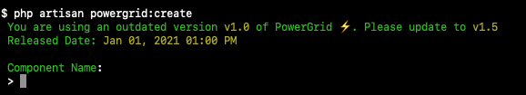

# Configure

## 1. Include Scripts and Styles

Include the following Scripts and Stylesheets in your page:

Styles must be included before the `</head>` tag.

```html
    <!-- Styles -->
    @livewireStyles
    @powerGridStyles

   </head>
```

Scripts must be included before the `</body>` tag.

```html
    <!-- Scripts -->
    @livewireScripts
    @powerGridScripts

</body>
```

> 💡 Read more about this requirement at the official [Livewire documentation](https://laravel-livewire.com/docs/2.x/quickstart)

## 2. Alpine JS

PowerGrid loads Alpine JS 3.0 by default.

If you already have Alpine JS loaded in your project, please change `'js_framework'` to null (no quotes).

```php
    /*
    |--------------------------------------------------------------------------
    | JS Framework
    |--------------------------------------------------------------------------
    */
    'js_framework' => null,
```

If you need to use a different version, change the URL inside the key `alpinejs` under `js_framework_cdn`.

The following example shows the usage of Alpine 2.8 CDN:

```php
    /*
    |--------------------------------------------------------------------------
    | Frameworks CDN
    |--------------------------------------------------------------------------
    */
    'js_framework_cdn' => [
        'alpinejs' => 'https://cdn.jsdelivr.net/gh/alpinejs/alpine@v2.8.2/dist/alpine.min.js'
```

<br>

📝 **NOTE:** Tailwind theme requires Alpine 2.8+.

<br>

## 3. Choose your Theme

PowerGrid supports Tailwind and Bootstrap 5 as Themes. Tailwind is selected by default.

Your Theme can be set at `config/livewire-powergrid.php`.

To change to Bootstrap 5, modify your `theme` option as follows:

```php
    /*
    |--------------------------------------------------------------------------
    | Theme
    |--------------------------------------------------------------------------
    */

    'theme' => \PowerComponents\LivewirePowerGrid\Themes\Bootstrap5::class,
```

Next, include jQuery and Bootstrap scripts in your page.

```html
<script src="https://code.jquery.com/jquery-3.6.0.slim.min.js"></script>

<script src="https://cdn.jsdelivr.net/npm/bootstrap@5.0.1/dist/js/bootstrap.bundle.min.js" integrity="sha384-gtEjrD/SeCtmISkJkNUaaKMoLD0//ElJ19smozuHV6z3Iehds+3Ulb9Bn9Plx0x4" crossorigin="anonymous"></script>
        
<!-- after -->
@powerGridScripts
```

## 4. Tailwind settings

### 4.1 Dark Mode

To enable Dark Mode, configure the `DarkMode` class in `tailwind.config.js` file as follows:

```json
module.exports = {
    darkMode: 'class',
}
```

### 4.2 JIT

If you use Tailwind JIT you must add PowerGrid files in `purge` inside the `tailwind.config.js` file:

```json
module.exports = {
    mode: ‘jit’,
    purge: [
        //…
        './vendor/power-components/livewire-powergrid/resources/views/**/*.blade.php',
        './vendor/power-components/livewire-powergrid/src/Themes/Tailwind.php',
    ],
}
```

> 💡 Read more about [Tailwind just-in-time](https://tailwindcss.com/docs/just-in-time-mode).

### 4.3 Tailwind Forms

If you use Tailwind forms, please consider modifying your `tailwind.config.js` to use the strategy `class` as follows:

```json
module.exports = {
   //...
  plugins: [
    require("@tailwindcss/forms")({
      strategy: 'class',
    }),
  ]
}
```

This approach will avoid layout conflicts such as:


> 💡 Read more about [Using classes instead of element selectors](https://github.com/tailwindlabs/tailwindcss-forms#using-classes-instead-of-element-selectors).

## 5. Cache

Cache is enabled by default. When using collections, it improves search performance.

When enabled, data is reloaded whenever the page is refreshed or a field is updated.

To disable cache, change `cached_data` to `false` in `config/livewire-powergrid.php`.

Example:

```php
    /*
    |--------------------------------------------------------------------------
    | Cache
    |--------------------------------------------------------------------------
    */

    'cached_data' => false,
```

## 6. Filters

PowerGrid offers inline and outside filters.

**inline**: Filters data inside the table (default).

**outside**: Filters data outside the table.

Inline is configured by default. To modify, change `filter` setting in `config/livewire-powergrid.php`.

Example:

```php
    /*
    |--------------------------------------------------------------------------
    | Filters
    |--------------------------------------------------------------------------
    */

    'filter' => 'outside',
```

## 7. New Release Notification

PowerGrid can verify if a new release is available when you create a new PowerGrid Table.



To enable this feature, follow the next steps:

**7.1. Require composer as a developer dependency, running:**

 ```bash
 composer require composer/composer --dev
 ```

**7.2. Change 'check_version' to `true` in `config/livewire-powergrid.php`.**

```php
    /*
    |--------------------------------------------------------------------------
    | New Release Notification
    |--------------------------------------------------------------------------
    */
    
    'check_version' => true
```
