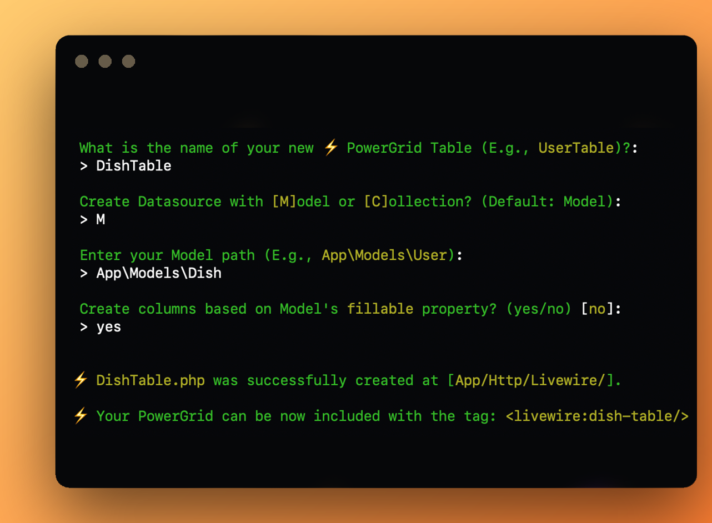

# Create a PowerGrid Table

> **❗ Important:** You must have PowerGrid [installed](https://livewire-powergrid.docsforge.com/main/install/) and properly [configured](https://livewire-powergrid.docsforge.com/main/configure/) before proceeding.

<br>

To create a PowerGrid table, run the following command:

```bash
php artisan powergrid:create  
```

<br>

Now, answer the question in your screen to complete the creation process:

**1. Enter the name of your PowerGrid Component.**

For example: `DishTable`.

---

<br>


**2. Indicate if your component will use a Model or a Collection as data source.**

Type `M` for Model or `C` for Collection.


This example uses the Dish Model, so we typed `M`:


---

<br>

**3. If you choose Model, enter the path to your Model.**

In this example, the Dish Model is located at App\Models\Dish.


---

<br>

**4. Use Fillable?**

PowerGrid can create columns based on your Model's `fillable` property.

Supported databases are: MySQL, Postgre and SQLite.

If desirable, type `yes` to use this feature.


---

<br>

**⚡ PowerGrid Table created!**

PowerGrid indicates the location where your new Table component was created.

You can also see the syntax to include the Table in your page:


