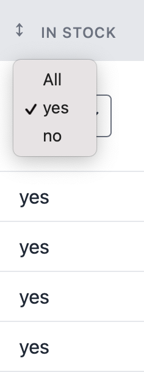
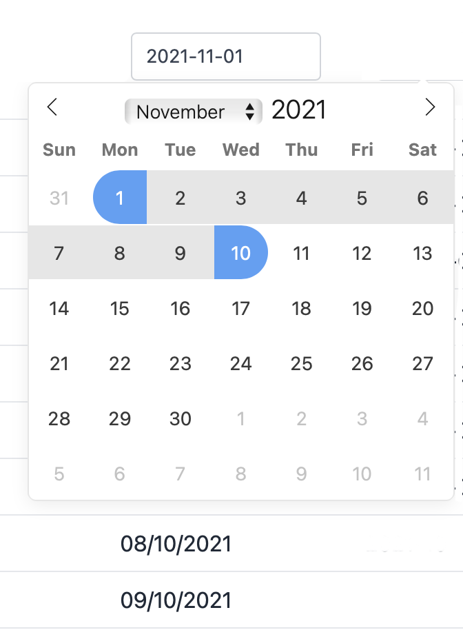
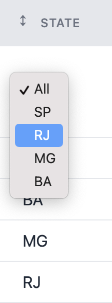
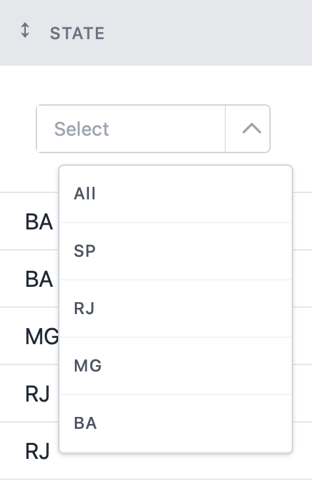

# Column Filters

Filters can be configured under each column, inside the [columns()](https://livewire-powergrid.docsforge.com/main/include-columns/) method.

## Usage

You can add a filter to your column header by chaining a [Filter method](#filter-methods) to `Column::add()`.

The following example adds a range filter (min/max) to the "Dish Quantity" column.

```php
public function columns(): array
{
  return [
    Column::add()
        ->title('Dish Quantity')
        ->field('quantity'),
        ->makeInputRange(),
  ];
}
```

## Filter methods

These methods enable input for filters at your column header.

### makeInputText(string $dataField)

Adds an input text filter on the column.

Parameters:

- `$dataField`: field used by the filter.

Example:

`->makeInputText('name')`

Result:


### makeBooleanFilter(string $dataField, string $trueLabel, string $falseLabel)

Adds a filter for boolean values.

Parameters:

- `$dataField`: field used by the filter.
- `$trueLabel`: select option displayed for `true` (E.g, 'Active')
- `$trueLabel`: select option displayed for `false` (E.g, 'Inactive')

Example:

`->makeBooleanFilter('in_stock', 'yes', 'no')`

Result:



---

### makeInputDatePicker(string $dataField, array $settings = [], string $classAttr = '')

Includes a specific field on the page to filter between the specific date in the column.

Parameters:

- `$dataField`: field used by the filter.
- `$settings`: Settings must be passed as "key => value". Availables keys are:
  - `'only_future' => true`: Will not allow to select dates in the past.
  - `'no_weekends' => true`: Will not allow to select weekends.
- `$classAttr`: class to be applied.

Example:

`->makeInputDatePicker()`

Result:



---

### makeInputSelect($dataSource, string $name, string $dataField, array $settings)

Includes a specific field on the page to filter a hasOne relation in the column.

Parameters:

- `$dataSource`: parameter must be a [Datasource](https://livewire-powergrid.docsforge.com/main/datasource/).
- `$name`: datasource field name to be displayed in options.
- `$dataField`: field used by the filter.

Options:

- `live-search =>  [true/false]` feature works only with Bootstrap.
- `class => ''` adds a class to your select element.

Example:

`->makeInputSelect(Kitchen::all(), 'state', 'kitchen_id', ['live-search' => true])`

Result:



---

### makeInputMultiSelect($dataSource, string $name, string $dataField)

Includes a specific field on the page to filter a hasOne relation in the column.

Parameters:

- `$dataSource`: parameter must be a [Datasource](https://livewire-powergrid.docsforge.com/main/datasource/).
- `$name`: datasource field name to be displayed in options.
- `$dataField`: field used by the filter.

Example:

`->makeInputMultiSelect(Kitchen::all(), 'state', 'kitchen_id')`

Result:



---

### makeInputRange(string $dataField, string $thousands, string $decimal)

Adds a range filter input (min and max values).

The following example adds a range filter on "Dish Quality" column, filtering with `quantity` field.

```php
public function columns(): array
{
  return [
    Column::add()
        ->title('Dish Quantity')
        ->field('quantity'),
  ];
}
```

The example below sets `$thousands` and `$decimal` separators. This is useful with currency values.

PowerGrid parses the formatted `1.170,90` into a decimal number (`1170.90`) and filter data based on the `price` field.

```php
public function columns(): array
{
  return [
    Column::add()
      ->title('Price')
      ->field('price_in_brl')
      ->makeInputRange('price', '.', ','),
  ];
}
```

Result:


## Filter by Relationship

To filter by relationships, add each relationship of your main [Datasource](https://livewire-powergrid.docsforge.com/main/datasource/) Table in the `relationSearch` method.

The relationships must be added in the format:

`'model_name' => ['search_column_A', 'search_column_B'...]`.

Example:  

```php
public function relationSearch(): array
{
    return [
        'kitchen' => [ // relationship on dishes model
            'name', // column enabled to search
        ],
        //...
    ];
}
```

The example above adds the relationship to the `kitchen`  Model and allows the column `name` to be searched.
