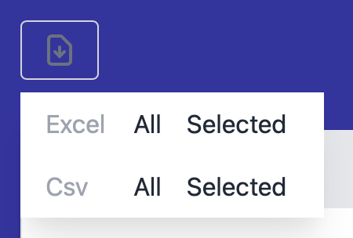
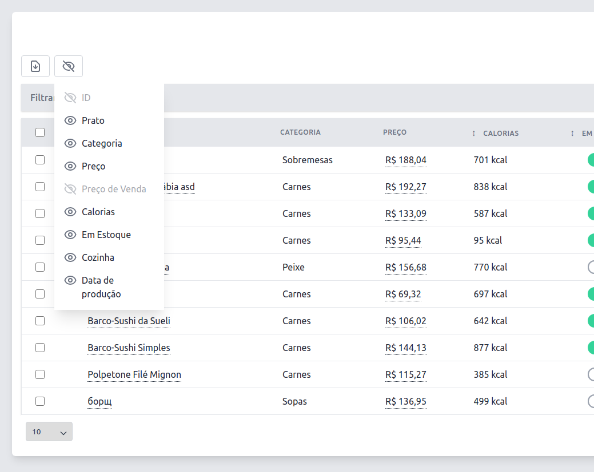

# Features Setup

The `setup()` method controls general features present in your Table.

You can find this method inside your PowerGrid file (e.g. `DishTable.php`).

Example of usage:

```php
//..
public function setUp()
{
   $this->showCheckBox()
      ->showRecordCount('short')
      ->showPerPage()
      ->showSearchInput()
      ->showExportOption('download', ['excel', 'csv']);
}
```

You can chain the methods to configure the following features:

<br>

## showCheckBox()

Enables and displays checkboxes on each table row.

Result:


---

## showPerPage(int $perPage)

Shows a dropdown menu to select the number of rows per page  (default: 10).

Set the parameter `$perPage` to show a fixed number of rows instead of allowing the user to select.

Example:

`->showPerPage()`

Result:


---

## showSearchInput()

Enables the search functionality and show the search input field at the page top.

Result:


---

## showRecordCount(string $mode)

Shows the record count at the page bottom.

Available modes:

- **full** (default): Full sentence. E.g., `Showing 1 to 10 of 100 Results`.
- **short**: Only numbers including total. E.g, `1 - 10 | 100`.
- **min**: Only numbers, without total. E.g., `1 - 10`

Example:

`->showRecordCount('full')`

Result:


---

## showExportOption(string $fileName, array $type)

Enable the `export to file` functionality and shows export button at the page top.

The file name (`$fileName`) and file type must be provided.

Available file types:

- *excel*
- *csv*

Example:

`->showExportOption('my-dish-table', ['excel', 'csv])`

Result:



> 💡 If you are working with lots of data, we recommend to use [Queue Export](https://livewire-powergrid.docsforge.com/main/queue-export/).

---

## showToggleColumns()

Displays the button to hide/show (toggle) columns.

Example:

`->showToggleColumns()`

Result:


