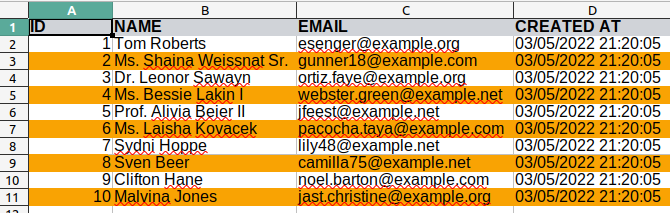
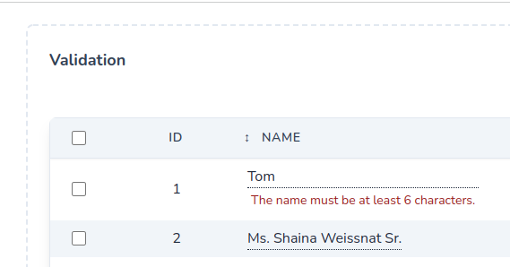
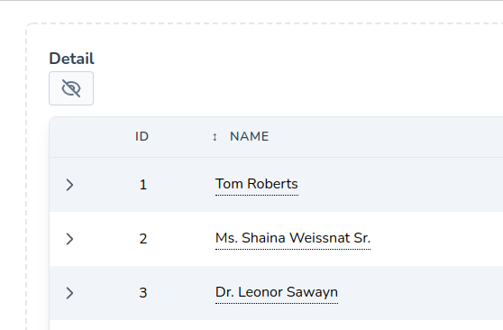
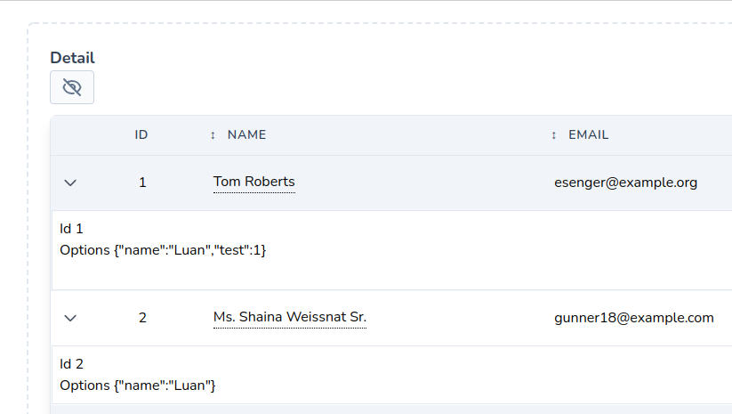

# Release Notes

### Dependencies

Powergrid was born with the intention of always keeping as close as possible to the latest laravel update, so we updated the minimum versions of php, tailwind and livewire for greater support and durability.

[Read more](get-started/upgrade-guide?id=dependency-upgrades)

---

### Improved setUp method

We changed the way we handle powergrid component initialization to make it easier to add new methods and improvements to isolated parts.

[Read more](table/features-setup?id=features-setup)

---

### Export using openspout/openspout

We removed the previous package [box/spout](https://github.com/box/spout) by [openspout/openspout](https://github.com/openspout/openspout). 
This will bring new opportunities and improvements in export and PHP 8 higher compatibility.

[Read more](https://github.com/openspout/openspout#copyright-and-license)

---

### Ability to place stripes on export

From this version we can define the color itself in the export listing by passing the `striped('color')` parameter (XLS only) .

```php
    public function setUp(): array
    {       
        return [
            Exportable::make('export')
                ->striped('f9a303') // Hex without '#'
                ->type(Exportable::TYPE_XLS),
        ];
    }
```

Result:



[Read more](https://github.com/openspout/openspout#copyright-and-license)

---

### Design improvement

We made some layout improvements (tailwind only).

Result:


---

### Show ErrorBag in editOnClick line

Now we can show an error message directly on the editOnClick line after being checked
via the `$this->validate()` method in the backend.

It will be activated when `$showErrorBag = true`;

Here's an example:

```php
    public bool $showErrorBag = true;

    protected array $rules = [
        'name.*' => ['required', 'min:6'],
    ];
    
    public function columns(): array
    {
         return [
             Column::add()
                ->title('Name')
                ->field('name')
                ->editOnClick(true)
         ];
    }

    public function onUpdatedEditable($id, $field, $value): void
    {
        $this->validate();
        User::query()->find($id)->update([
            $field => $value,
        ]);
    }

```

Result:



---

### Detail row (tailwind only)

Now we can enter details for each row reusing the component details.

Example:
```php
   use PowerComponents\LivewirePowerGrid\Detail;

   public function setUp(): array
    {
        return [
            Detail::make()
                ->view('components.detail') // views/components.detail.blade.php
                ->options(['name' => 'Luan'])
                ->showCollapseIcon(),
        ];
    }
```
`view/components.detail.blade.php`
```html
<div class="p-2 bg-white border border-slate-200">
    <div>Id {{ $id }}</div>
    <div>Options @json($options)</div>
</div>
```

Result - Detail closed:



Result - Detail open:



We can also switch the view to a specific row using [Action Rules](table/action-rules?id=action-rules).

`toggleDetail()` method will toggle the detail.

```php
    public function actions(): array
    {
        return [
            Button::make('detail', 'Detail')
                ->class('bg-indigo-500 rounded-md cursor-pointer text-white px-3 py-2 m-1 text-sm')
                ->toggleDetail(),
        ];
    }

    public function actionRules(): array
    {
        return [
            Rule::rows()
                ->when(fn (User $user) => $user->id == 1)
                // view, array $options
                ->detailView('components.detail-rules', ['test' => 1]),
        ];
    }

```

[Read more](get-started/release-notes?id=improved-setup-method)

---

### Column make

New tables will be created with `Column::make` instead of `Column::add()->title ...`

Previous example (not deprecated).
```php
    <!-- Before -->
    public function columns(): array
    {
         return [
             Column::add()
                ->title('Name')
                ->field('name')
         ];
    }
```
Now:
```php
    <!-- After -->
    public function columns(): array
    {
         return [
             // make(string $title, string $field, string $dataField = '')
             Column::make('Name', 'name', 'dishes.name')
         ];
    }
```

---

### Button make

Similar the column, the buttons will also come with `Button::make`

Previous example (not deprecated).
```php
    <!-- Before -->
    public function actions(): array
    {
         return [
             Button::add('detail')
                ->caption('Detail')
         ];
    }
```
Now:
```php
    <!-- After -->
    public function actions(): array
    {
         return [
             // make(string $action, string $caption)
             Button::add('detail', 'Detail')
         ];
    }
```
---
###

<hr />
<footer style="float: right; font-size: larger">
    <span><a style="text-decoration: none;" href="#/get-started/upgrade-guide">Upgrade Guide →</a></span>
</footer>