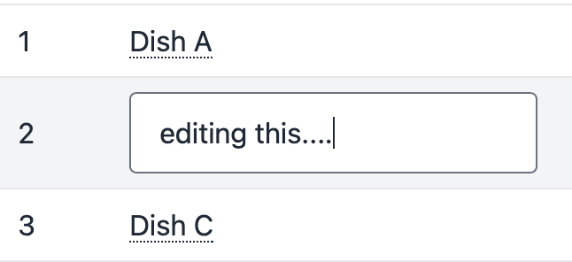
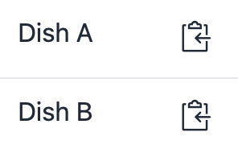
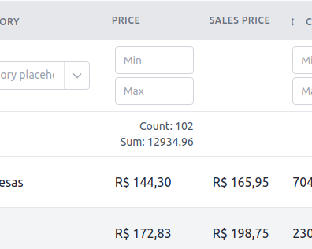

# Cell Action Buttons

Cell Action buttons can be configured in each column inside the [columns()](table/include-columns) method.

This method is inside your PowerGrid file (e.g. `DishTable.php`).

## Usage

You can add buttons to your each cell of a column by chaining [Cell Action methods](#cell-action-methods) to `Column::add()`.

The following example adds a `toggleable` button to each cell of "In Stock" column.

```php
//...
public function columns(): array
{
  $canEdit = true; //User has edit permission

    return [

        Column::add()
            ->title('In Stock')
            ->field('in_stock'),
            ->makeBooleanFilter('in_stock', 'yes', 'no')
            ->toggleable($canEdit, 'yes', 'no'),
    ];
}
```

## Cell Action Methods

These methods will add action buttons to each cell of a specific column in your Table.

### editOnClick(bool $isEditable)

If `$isEditable` is `true`, an "action link" will be displayed in the cell.

When the user clicks on this link, the cell is converted into an input text.

The content can be edited and saved by pressing the `<enter>` key.

Example:

```php
//...
$canEdit = true; //User has edit permission

Column::add()
    ->title('Name')
    ->field('name'),
    ->editOnClick($canEdit),
```

Result:



!> **❗ Important:** editOnClick on click requires [Update Data](table/update-data?id=update-data) method to be configured.

!> **❗ ️Important:** This feature is not available when using table.column notation on $primaryKey (E.g., $primaryKey = 'dishes.name')

### toggleable(bool $isToggleable, string $trueLabel, string $falseLabel)

If `isToggleable` is `true`, the table cell will be converted into a `toggleable` button.

When it is `false`, the table cell will contain the text passed in `$trueLabel`/`$falseLabel`, according to its `boolean` value.

This is useful when the user do not have permission to edit data and must see a text instead of a button.

Example:

```php
//...
$canEdit = true; //User has edit permission

Column::add()
    ->title('In Stock')
    ->field('in_stock'),
    ->makeBooleanFilter('in_stock', 'yes', 'no')
    ->toggleable($canEdit, 'yes', 'no'),
```

Result:


!> **❗ Important:** toggleable requires [Update Data](table/update-data?id=update-data) method to be configured.

!> **❗ Important:** This feature is not available when using table.column notation on $primaryKey (E.g., $primaryKey = 'dishes.name').

---

### clickToCopy(bool $hasPermission, string $caption)

If `$hasPermission` is `true`, PowerGrid appends a `click to copy button` to your table cell.

The argument `$caption` sets the button caption.

Example:

```php
//...
$canCopy = true; //User has permission to copy

Column::add()
    ->title('Name')
    ->field('name'),
    ->clickToCopy($canCopy, 'Copy name to clipboard'),
```

Result:



---

### withSum(string $label = 'Sum', bool $header = false, bool $footer = false)

!> **❗ Important:** This will pre-process all the data in your database to work with the sum of all records. **->get()**;

!> **❗ Important:** In all cases, only one request is made;

Will display the sum of all records in the field

The argument `$label` sets the button caption.

If `$header` is `true`, Powergrid will create a row in the table below the filters.

If `$footer` is `true`, Powergrid will create a row in the footer of the table.

Example:

```php
//...
Column::add()
    ->title(__('Price'))
    ->field('price')
    ->withSum('Sum', true, false),
```

Result:


💡 *Tip* Read more about [formatting](#/table/cell-actions-buttons?id=formatting-column-totals) the sum output.

---

### withCount(string $label = 'Count', bool $header = false, bool $footer = false)

Will display the count of all records in the field

The argument `$label` sets the button caption.

If `$header` is `true`, Powergrid will create a row in the table below the filters.

If `$footer` is `true`, Powergrid will create a row in the footer of the table.

Example:

```php
//...
Column::add()
    ->title(__('Price'))
    ->field('price')
    ->withSum('Sum', true, false)
    ->withCount('Count', true, false),
```

Result:


💡 *Tip* Read more about [formatting](#/table/cell-actions-buttons?id=formatting-column-totals) the count output.

---

### withAvg(string $label = 'Avg', bool $header = false, bool $footer = false)

Will display the avg of all records in the field

The argument `$label` sets the button caption.

If `$header` is `true`, Powergrid will create a row in the table below the filters.

If `$footer` is `true`, Powergrid will create a row in the footer of the table.

The `$rounded` argument returns the rounded value of num to specified precision

Example:

```php
//...
Column::add()
    ->title(__('Price'))
    ->field('price')
    ->withSum('Sum', true, false)
    ->withCount('Count', true, true)
    ->withAvg('Avg', true, false, 2),
```

Result:


💡 *Tip* Read more about [formatting](#/table/cell-actions-buttons?id=formatting-column-totals) the average output.

### Formatting Column Totals

If you want to format the total resulting from `withSum()`, `withCount()` or, `withAverage()` you can use each of the respective methods: `->formatSum()`, `->formatCount()` and `->formatAvg()`. Each method requires a parameter `callable` where you can format the result.

The code below shows how to format the `withSum()` on Price column and display it as Currency:

```php
Column::add()
    ->title(__('Price'))
    ->field('price')
    ->withSum('Sum', true, false)
    ->formatSum(fn ($sum) =>  'R$ ' . number_format($sum, 2, '.', ',')), //12934.96 ➔ R$ 1,2934.96
```

---
<hr/>
<footer style="float: right; font-size: larger">
    <span><a style="text-decoration: none;" href="#/table/row-actions-buttons?id=row-action-buttons">Next →</a></span>
</footer>
