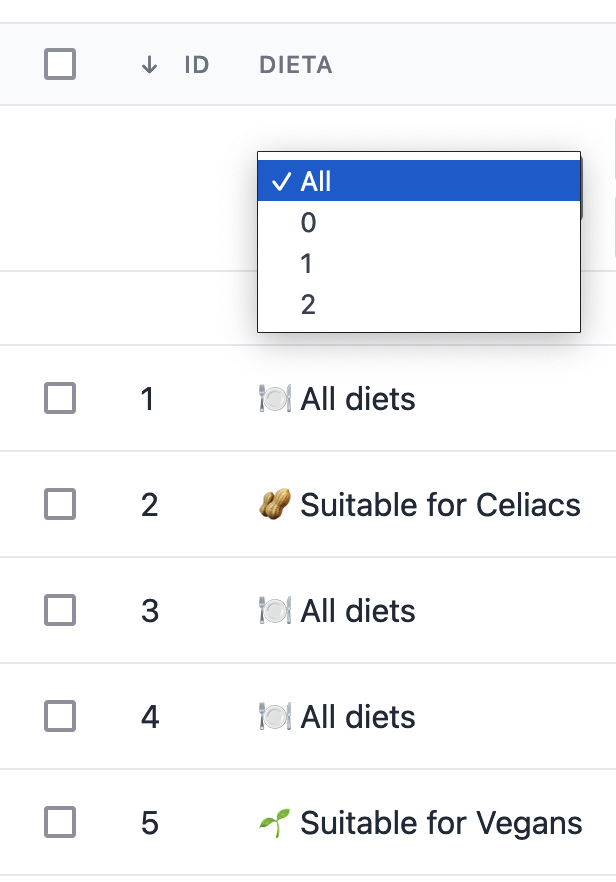
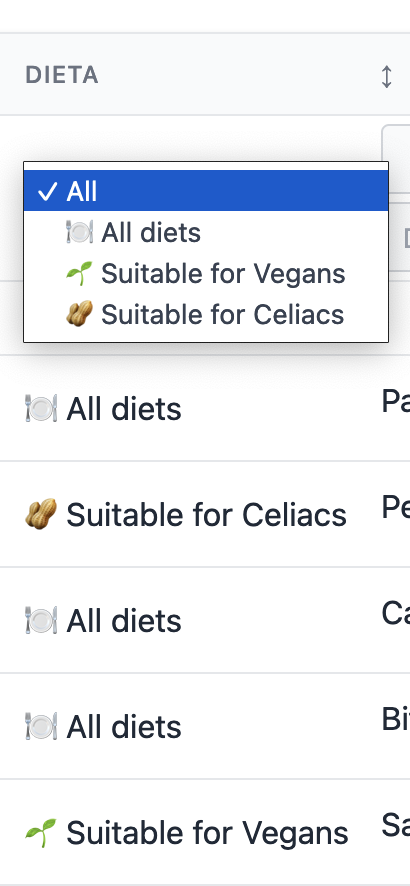
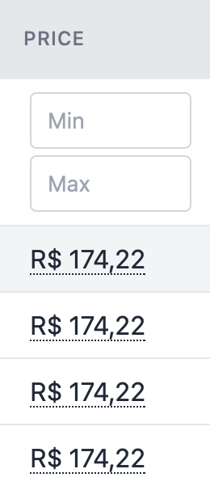

# Column Filters

Filters can be configured under each column, inside the [columns()](table/include-columns?id=include-columns) method.

## Usage

You can add a filter to your column header by chaining a [Filter method](#filter-methods) to `Column::add()`.

The following example adds a range filter (min/max) to the "Dish Quantity" column.

```php
public function columns(): array
{
  return [
    Column::make('Dish Quantity', 'quantity'),
        ->makeInputRange(),
  ];
}
```

## Filter methods

These methods enable input for filters at your column header.

### makeInputText(string $dataField)

Adds an input text filter on the column.

Available filters are: `Is/Is not`, `Contains/Does not contain`, `Starts with/Ends with`,`Is null/Is not null`, `Is blank\Is not Blank`, `Is blank\Is not blank`,  `Is empty/Is not empty`. "Empty" covers "Blank + Null".

Parameters:

- `$dataField`: field used by the filter.

Example:

`->makeInputText(dataField: 'name')`

Result:


---

### makeBooleanFilter(string $dataField, string $trueLabel, string $falseLabel)

Adds a filter for boolean values.

Parameters:

- `$dataField`: field used by the filter.
- `$trueLabel`: select option displayed for `true` (E.g, 'Active')
- `$falseLabel`: select option displayed for `false` (E.g, 'Inactive')

Example:

`->makeBooleanFilter(dataField: 'in_stock', trueLabel: 'yes', falseLabel: 'no')`

Result:


---

### makeInputDatePicker(string $dataField, array $settings = [], string $classAttr = '')

Includes a specific field on the page to filter between the specific date in the column.

Configure a linguagem no arquivo `config/livewire-powergrid.php` como no exemplo de acordo com a sua `config/app` - locale.
```php
 'plugins' => [
        // ..
        'flatpickr' => [
            // ..
            'locales'   => [
                'pt_BR' => [
                    'locale'     => 'pt',
                    'dateFormat' => 'd/m/Y H:i',
                    'enableTime' => true,
                    'time_24hr'  => true,
                ],
                'uk' => [
                    'locale'     => 'uk',
                    'dateFormat' => 'd/m/Y',
                    'enableTime' => false,
                    'time_24hr'  => true,
                ],
            ],
        ],
    ],
```

Parameters:

- `$dataField`: field used by the filter.
- `$settings`: Settings must be passed as "key => value". Availables keys are:
  - `'only_future' => true`: Will not allow to select dates in the past.
  - `'no_weekends' => true`: Will not allow to select weekends.
- `$classAttr`: class to be applied.

Example:

`->makeInputDatePicker('created_at')`

Result:


---

### makeInputSelect($dataSource, string $name, string $dataField, array $settings)

Includes a specific field on the page to filter a hasOne relation in the column.

Parameters:

- `$dataSource`: parameter must be a [Datasource](table/datasource?id=datasource).
- `$name`: datasource field name to be displayed in options.
- `$dataField`: field used by the filter.

Options:

- `live-search =>  [true/false]` feature works only with Bootstrap.
- `class => ''` adds a class to your select element.

Example:

`->makeInputSelect(Kitchen::all(), 'state', 'kitchen_id', ['live-search' => true])`

Result:


---

### makeInputMultiSelect($dataSource, string $name, string $dataField)

Includes a specific field on the page to filter a hasOne relation in the column.

Parameters:

- `$dataSource`: parameter must be a [Datasource](table/datasource?id=datasource).
- `$name`: datasource field name to be displayed in options.
- `$dataField`: field used by the filter.

Example:

`->makeInputMultiSelect(Kitchen::all(), 'state', 'kitchen_id')`

Result:


---

### makeInputEnumSelect(array $enumCases, string $dataField = null, array $settings = [])

Includes a select filter based in a PHP Enum.

Available only in `Php 8.1+`.

Parameters:

- `$enumCases`: parameter must be a `enum`.
- `$dataField`: field used by the filter.
- `$settings`: Settings

Usage:  `->makeInputEnumSelect(Diet::cases(), 'dishes.diet')`

Example:

Consider the following Enum with Dietary restrictions.

The database field `diet` contains the `int` values (0, 1 or 2). In this Enum we added a method `label()` to display a human friendly value for each case.

```php
<?php

enum Diet: int
{
    case ALL      = 0;
    case VEGAN    = 1;
    case CELIAC   = 2;

    public function labels(): string
    {
        return match ($this) {
            self::ALL         => "🍽️ All diets",
            self::VEGAN       => "🌱 Suitable for Vegans",
            self::CELIAC      => "🥜 Suitable for Celiacs",
        };
    }
}
```

In PowerGrid you can make use of [closures](table/add-columns.md?id=enum) to display your Enum labels instead of the default database values.

Including the column with filter:

```php
//...

//Including column
Column::add()
    ->field('diet', 'dishes.diet')
    ->makeInputEnumSelect(Diet::cases(), 'dishes.diet')
    ->title(__('Dieta')),
```

Result:



To display your `labels` instead of case values, you can inlcude the `labelPowergridFilter` method inside your enum.

```php
<?php

enum Diet: int
{
    //...

   /**
     * Sends labels to PowerGrid Enum Input
     *
     */
    public function labelPowergridFilter(): string
    {
        return $this->labels();
    }
}
```



---

### makeInputRange(string $dataField, string $thousands, string $decimal)

Adds a range filter input (min and max values).

The following example adds a range filter on "Dish Quality" column, filtering with `quantity` field.

```php
public function columns(): array
{
  return [
      Column::make('Dish Quantity', 'quantity'),
  ];
}
```

The example below sets `$thousands` and `$decimal` separators. This is useful with currency values.

PowerGrid parses the formatted `1.170,90` into a decimal number (`1170.90`) and filter data based on the `price` field.

```php
public function columns(): array
{
  return [
      Column::make('Price', 'price_in_brl')
          ->makeInputRange('price', '.', ','),
  ];
}
```

Result:



## Filter by Relationship

To filter by relationships, add each relationship of your main [Datasource](table/datasource?id=datasource) Table in the `relationSearch` method.

The relationships must be added in the format:

`'model_name' => ['search_column_A', 'search_column_B'...]`.

Example:  

```php
public function relationSearch(): array
{
    return [
        'kitchen' => [ // relationship on dishes model
            'name', // column enabled to search
        ],
        //...
    ];
}
```

The example above adds the relationship to the `kitchen`  Model and allows the column `name` to be searched.

<hr/>
<footer style="float: right; font-size: larger">
    <span><a style="text-decoration: none;" href="#/table/column-summary">Column Summary →</a></span>
</footer>
