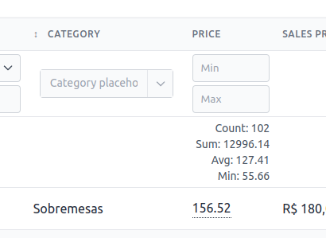
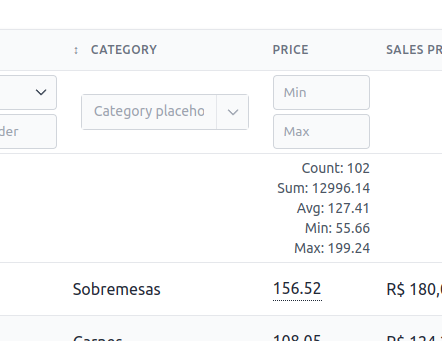

# Column Summary

PowerGrid can include data summaries inside each [columns()](table/include-columns) header.

Summaries can display the column's sum, count, average, min and max value.

## Usage

Summaries are chained to the `Column::add()` method.

### withSum(string $label = 'Sum', bool $header = false, bool $footer = false)

!> **❗ Important:** This will pre-process all the data in your database to work with the sum of all records. **->get()**;

!> **❗ Important:** In all cases, only one request is made;

Will display the sum of all records in the field

The argument `$label` sets the button caption.

If `$header` is `true`, Powergrid will create a row in the table below the filters.

If `$footer` is `true`, Powergrid will create a row in the footer of the table.

Example:

```php
//...
Column::add()
    ->title(__('Price'))
    ->field('price')
    ->withSum('Sum', true, false),
```

Result:


---

### withCount(string $label = 'Count', bool $header = false, bool $footer = false)

Will display the count of all records in the field

The argument `$label` sets the button caption.

If `$header` is `true`, Powergrid will create a row in the table below the filters.

If `$footer` is `true`, Powergrid will create a row in the footer of the table.

Example:

```php
//...
Column::add()
    ->title(__('Price'))
    ->field('price')
    ->withSum('Sum', true, false)
    ->withCount('Count', true, false),
```

Result:


---

### withAvg(string $label = 'Avg', bool $header = false, bool $footer = false)

Will display the avg of all records in the field

The argument `$label` sets the button caption.

If `$header` is `true`, Powergrid will create a row in the table below the filters.

If `$footer` is `true`, Powergrid will create a row in the footer of the table.

Example:

```php
//...
Column::add()
    ->title(__('Price'))
    ->field('price')
    ->withSum('Sum', true, false)
    ->withCount('Count', true, true)
    ->withAvg('Avg', true, false),
```

Result:


---

### withMin(string $label = 'Min', bool $header = false, bool $footer = false)

Will display the min of all records in the field

The argument `$label` sets the button caption.

If `$header` is `true`, Powergrid will create a row in the table below the filters.

If `$footer` is `true`, Powergrid will create a row in the footer of the table.

Example:

```php
//...
Column::add()
    ->title(__('Price'))
    ->field('price')
    ->withSum('Sum', true, false)
    ->withCount('Count', true, true)
    ->withAvg('Avg', true, false),
    ->withMin('Min', true, false),
```

Result:


---

### withMax(string $label = 'Max', bool $header = false, bool $footer = false)

Will display the max of all records in the field

The argument `$label` sets the button caption.

If `$header` is `true`, Powergrid will create a row in the table below the filters.

If `$footer` is `true`, Powergrid will create a row in the footer of the table.

Example:

```php
//...
Column::add()
    ->title(__('Price'))
    ->field('price')
    ->withSum('Sum', true, false)
    ->withCount('Count', true, true)
    ->withAvg('Avg', true, false),
    ->withMin('Min', true, false),
    ->withMax('Max', true, false),
```

Result:


<hr/>
<footer style="float: right; font-size: larger">
    <span><a style="text-decoration: none;" href="#/table/cell-actions-buttons?id=cell-action-buttons">Next →</a></span>
</footer>