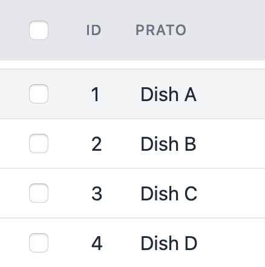
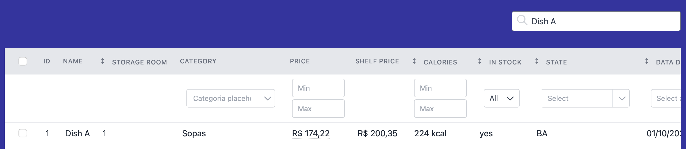
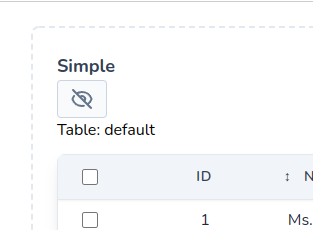
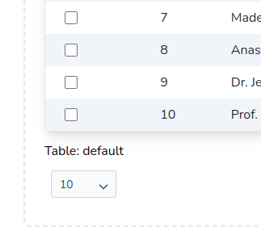

# Features Setup

The `setup()` method controls the general resources present in your Table by separate action type within the table (Header, Footer, Exportable, ...)

You can find this method inside your PowerGrid file (e.g. `DishTable.php`).

Example of usage:

```php
//..
use PowerComponents\LivewirePowerGrid\Header;
use PowerComponents\LivewirePowerGrid\Footer;

public function setUp(): array
{
    $this->showCheckBox();

     return [
         Header::make()
             ->showToggleColumns()
             ->showSearchInput(),

         Footer::make()
             ->showPerPage()
             ->showRecordCount(),
     ];
}
```

You can chain the methods to configure the following features:

### showCheckBox

Enables and displays checkboxes on each table row.

Example:
```php
public function setUp(): array
{
    $this->showCheckBox();
}
```

Result:



---
# Header

Here are some actions for the table header defined inside `setup`:

* showSearchInput
* showToggleColumns 
* includeViewOnTop
* includeViewOnBottom

## Header

### showSearchInput

Enables the search functionality and show the search input field at the page top.

```php
Header::showSearchInput()
```

Result:



---

### showToggleColumns

Displays the button to hide/show (toggle) columns.

> Works fine without inline filters
Example:

```php 
Header::showToggleColumns()
```

Result:


---

### includeViewOnTop

Sometimes we need to reuse the current scope of the table using @include instead of using events.

```php 
Header::includeViewOnTop('components.datatable.header-top')
```

> Inside the view you can use the component's variables

`view/components/datatable/header-top.blade.php`
```html 
<div>
    Table: {{ $tableName}}
</div>
```

Result:


---

### includeViewOnBottom

Sometimes we need to reuse the current scope of the table using @include instead of using events.

```php 
Header::includeViewOnBottom('components.datatable.header-bottom')
```

> Inside the view you can use the component's variables

`view/components/datatable/header-bottom.blade.php`
```html 
<div>
    Table: {{ $tableName}}
</div>
```

Result:



---

## Footer

Here are some actions for the table footer defined inside `setup`:
* > showPerPage, showRecordCount, pagination,  includeViewOnTop and includeViewOnBottom 


### showPerPage

Shows a dropdown menu for selecting the number of rows displayed per page (default: 10).

By default, `$perPage` accepts the values: `10`, `25`, `50`, `100` and `0` (zero represents "show all").

If you need a different set of values, you may override the `$perPageValues` array. See the following example:

```php
class DishesTable extends PowerGridComponent
{
    //Custom per page
    public int $perPage = 5;
    
    //Custom per page values
    public array $perPageValues = [0, 5, 10, 20, 50];

    public function setUp(): array
    {
        return [
            Footer::make()
                ->showPerPage($this->perPage, $this->perPageValues)
        ]   
    }
    //....
```

Result:


---

### showRecordCount

Shows the record count at the page bottom.

Available modes:

- **full** (default): Full sentence. E.g., `Showing 1 to 10 of 100 Results`.
- **short**: Only numbers including total. E.g, `1 - 10 | 100`.
- **min**: Only numbers, without total. E.g., `1 - 10`

Example:

```php
Footer::showRecordCount(mode: 'full')
```

Result:


---

### Pagination

Sometimes we need to customize the pagination of the table, for that do:

```php 
Footer::pagination('components/pagination')
```

> Inside the view you can use the paginator `variables, perPage and perPageValues` to build the footer

`views/components/pagination.blade.php`
```html 
<div class="w-full">
    @if ($paginator->hasPages())
    // ..
    
    @endif
</div>
```

Result:


---

### includeViewOnTop

Sometimes we need to reuse the current scope of the table using @include instead of using events.

```php 
Footer::includeViewOnTop('components.datatable.footer-top')
```

> Inside the view you can use the component's variables

`views/components/datatable/footer-top.blade.php`
```html 
<div>
    Table: {{ $tableName}}
</div>
```

Result:



---

### includeViewOnBottom

Sometimes we need to reuse the current scope of the table using @include instead of using events.

```php 
Header::includeViewOnBottom('components.datatable.footer-bottom')
```

> Inside the view you can use the component's variables

`views/components/datatable/footer-bottom.blade.php`
```html 
<div>
    Table: {{ $tableName}}
</div>
```

Result:


---
## Exportable

Enable the `export to file` functionality and shows export button at the page top.

```php
class DishesTable extends PowerGridComponent
{
    //Custom per page values
    public array $perPageValues = [0, 5, 10, 1000, 5000];

    public function setUp(): array
    {
        Exportable::make('export')
            ->striped('#A6ACCD')
            ->type(Exportable::TYPE_XLS, Exportable::TYPE_CSV),
    }
}
```

Set the filename inside `make('')`

Example:

```php
->make('my-export'),
```

--- 
### Types

Available file types:

- *excel - Exportable::TYPE_XLS* 
- *csv - Exportable::TYPE_CSV*

Example:

```php
->type(Exportable::TYPE_XLS, Exportable::TYPE_CSV),
```

--- 

### Striped 

You can also pass the `striped` parameter with the name of the color to be generated with striped lines.

Example:

```php
->stripe('A6ACCD'),
```

Result:


--- 

### Column width

Specify column and size if you need to increase [column width](https://github.com/openspout/openspout/blob/4.x/docs/documentation.md#column-widths) on export.

> XLSX only

Example:

```php
->columnWidth([
    2 => 30,
    4 => 20,
]),
```

> 💡 If you are working with lots of data, we recommend to use [Queue Export](table/queue-export).

---

## Persist

If you need the state of columns and filters to be saved in cookies, you can use the persist method.

Example:

```php
class DishesTable extends PowerGridComponent
{
    public function setUp(): array
    {
        $this->persist(['columns', 'filters']);
        
        return [
            // ..
        ];   
    }
}
```

Result:


<hr/>
<footer style="float: right; font-size: larger">
    <span><a style="text-decoration: none;" href="#/table/datasource">Datasource →</a></span>
</footer>
